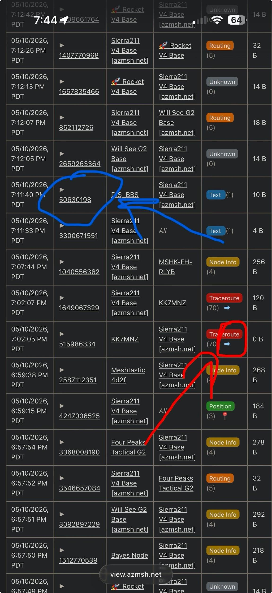

---
hide:
  - navigation
title: What Now?
description: Your node is set up and you've sent your first message — now what? The post-setup playbook for new Arizona Meshtastic operators.
---

# What Now?

So you have your node set up and the app is all downloaded. You connected and sent your first message. **Now what?**

This page is for the moment right after [How to Connect](/docs/how-to-connect.html) — your radio works, you're talking to the mesh, and you're wondering what the next move is.

---

## Claim Your Node

Type `/node claim` in Discord. This helps others know the node is yours so they can tag you when they have questions, hear you on the air, or want to know if you can hear them.

---

## Opt In for Diagnostic Data

Have you clicked the :pie: reaction in the **#getting-started** channel on Discord?

Opting in unlocks:

- More diagnostic data on your node
- Access to [view.azmsh.net](https://view.azmsh.net) — our community map and MQTT diagnostics tool

[:fontawesome-brands-discord: Join the Discord](https://discord.gg/HrKtyuFEQk){ .md-button .md-button--primary }

---

## Check Your Messages and Trace Routes

Once you've opted in, search for your node on [view.azmsh.net/nodelist](https://view.azmsh.net/nodelist).

{ .center }

- **Red (Traceroutes):** Click the arrow next to the trace routes and it'll show you the path your trace routes took — and when others trace route you. You can run trace routes by clicking on a node in the node list, scrolling down, and tapping **Trace Route**. You'll get a cool graph of where your trace route went trying to hit that node and get back home.
- **Blue (Message stats):** Click the number ID for any text message you sent to see the stats for that specific message, including which nodes it hit on the way.

---

## Run "test"

Meshtastic is part art and part science. The art part is trying a lot of things and testing to see what works best — everyone's setup and location is different.

1. Say `test` in the **Primary MediumFast** channel as many times as you want. A lot of our users have **MeshMonitor** installed which will respond with a tapback emoji: :one: :two: :three: :four: :five: :six: :seven: for how many hops away they are from you, or :asterisk: for a direct hit.
2. If you aren't getting those responses, try different locations — inside, outside, near windows. Outdoors makes a big difference.
3. Try putting your node higher. **Height is might.**
4. Run a few trace routes and check the results in **#traceroutes** on Discord.
5. Keep doing the above until you see success. Try every location and see what works best for you.

---

## Check Your Settings

The #1 issue we see new operators run into is missing a setting — or turning something on that shouldn't be on.

Make sure every setting on the [Recommended Settings](/docs/recommended-settings.html) page is configured, and nothing else.

!!! tip "When in doubt, leave it alone"
    If you aren't fully aware of what a setting does, don't mess with it. If you want someone to check your settings, start a thread in **#i-need-help** on Discord — we're happy to take a look.

---

## Not Receiving or Transmitting Reliably?

A lot of solar and battery-powered nodes transmit at very low wattage — **0.05W to 0.5W**. If you've tried every location and gotten your node as high as possible, it might be time to explore the **1W and higher** options on our [Recommended Hardware](/docs/recommended-hardware.html) page.

A better antenna is often the single biggest improvement you can make before upgrading the radio itself.

---

## I'm Talking on the Mesh!

**Nice job — you did it!** :tada:

Here's what to do next:

- **Join more channels.** Hop into the topic channels on Discord for traceroutes, hardware, and the help threads.
- **Sunday night chat.** Join us every Sunday at **5pm** on the **Primary MediumFast** channel for our weekly community chat.
- **Get your friends and family on the mesh.** The more nodes we have, the better the network works for everyone. Send them to [How to Connect](/docs/how-to-connect.html) to get started.

[:fontawesome-brands-discord: Join the Discord](https://discord.gg/HrKtyuFEQk){ .md-button .md-button--primary }
