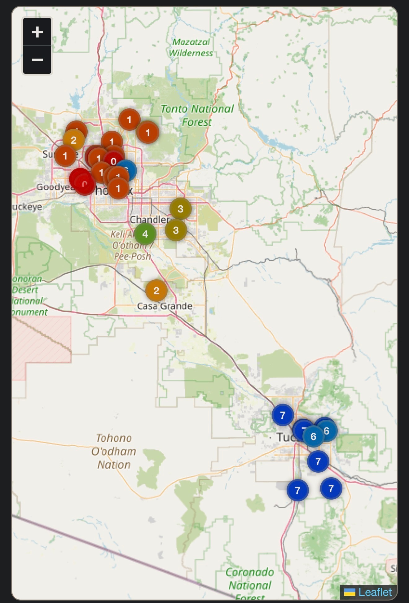
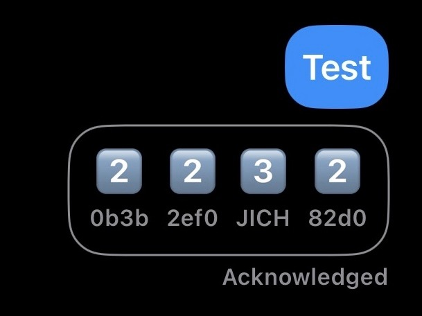
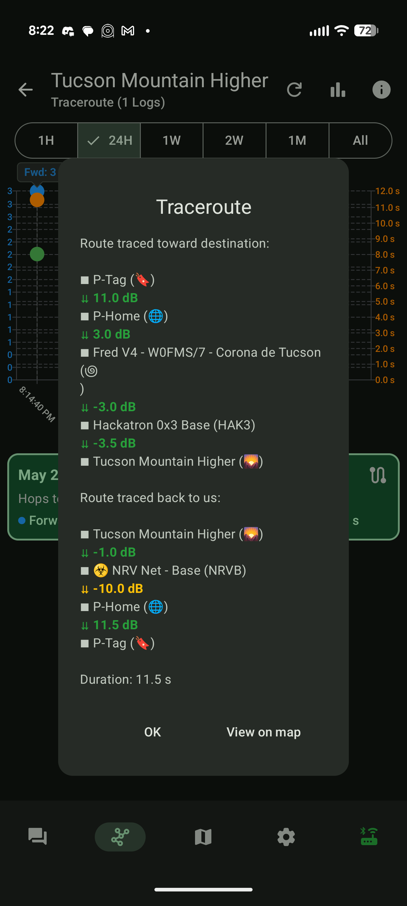
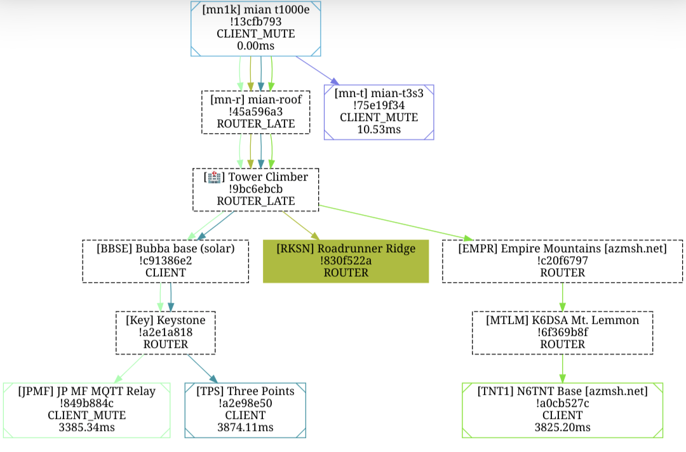

---
hide:
  - navigation
title: What Now?
description: You set up your node and configured your settings — now how do you check if anyone can hear you? The post-setup playbook for new Arizona Meshtastic operators.
---

# What Now?

So you've got your node set up, the app downloaded, all your settings configured. You connected. **Now what? How do you know if it's actually working — if anyone out there can hear you?**

This page is the moment right after [How to Connect](/docs/how-to-connect.html) — your radio is on, your settings are dialed in, and you're staring at the screen wondering: *did I do this right?*

Here's how to find out.

---

## Step 1 — Say "test" on the Mesh

Meshtastic is part art and part science. The art part is trying a lot of things and testing to see what works — everyone's setup and location is different.

1. Type `test` in the **Primary MediumFast** channel. Send it. (Send it as many times as you want.)
2. A lot of our users run **MeshMonitor** which will respond automatically with a tapback emoji:
   - :one: :two: :three: :four: :five: :six: :seven: — how many hops away that user is from you
   - :asterisk: — direct hit (no hops, they heard you straight)
3. **Got tapbacks? Congrats — you're on the mesh.** Skip to [Step 4](#step-4-claim-your-node-opt-in-for-diagnostics).
4. **No tapbacks?** Don't panic. Keep reading.

---

## Step 2 — Not Getting Responses? Move Around.

If `test` is getting crickets, the most common fixes are physical, not technical.

1. **Try different locations.** Inside vs outside makes a huge difference. Near a window vs interior wall — also big.
2. **Get higher.** **Height is might.** Roof, balcony, second floor — anywhere that gives your antenna line-of-sight to the sky and the surrounding terrain.
3. **Step outside completely.** Even a 30-second outdoor test will tell you whether your indoor location is the problem.
4. **Try at different times of day.** The mesh ebbs and flows — if no one's around when you test, you'll hear nothing.

Keep doing the above until you see something land. Try every location, see what works best for you.

---

## Step 3 — Still Nothing? Check Your Settings.

The **#1 issue** we see new operators run into is missing a setting — or turning something on that shouldn't be on.

Make sure every setting on the [Recommended Settings](/docs/recommended-settings.html) page is configured correctly, and nothing else.

!!! tip "When in doubt, leave it alone"
    If you aren't fully sure what a setting does, don't mess with it. If you want someone to check your settings, start a thread in **#i-need-help** on Discord — we're happy to take a look.

### Still receiving or transmitting unreliably?

A lot of solar and battery-powered nodes transmit at very low wattage — **0.05W to 0.5W**. If you've tried every location, gotten your node as high as possible, and confirmed your settings — it might be time to look at the **1W and higher** options on our [Recommended Hardware](/docs/recommended-hardware.html) page.

A better antenna is often the **single biggest** improvement you can make before upgrading the radio itself.

---

## Step 4 — Claim Your Node + Opt In for Diagnostics

Now that you're heard on the mesh, plug into the community side.

**Claim your node.** Type `/node claim` in Discord. This helps others know the node is yours — they can tag you when they have questions, hear you on the air, or want to know if you can hear them.

**Opt in for diagnostic data.** Click the :pie: reaction in the **#getting-started** channel on Discord. Opting in unlocks:

- More diagnostic data on your node
- Access to [view.azmsh.net](https://view.azmsh.net) — our community map and MQTT diagnostics tool

[:fontawesome-brands-discord: Join the Discord](https://discord.gg/HrKtyuFEQk){ .md-button .md-button--primary }

---

## Step 5 — Check Your Messages and Trace Routes

Once you've opted in, search for your node on [view.azmsh.net/nodelist](https://view.azmsh.net/nodelist) to see what's actually happening on the air.

<figure style="margin: 0 auto; max-width: 320px;">
  
  <figcaption style="text-align: center; font-size: 0.85em; opacity: 0.75;">view.azmsh.net/nodelist — click to enlarge</figcaption>
</figure>

- **Red (Traceroutes):** Click the arrow next to the trace routes and it'll show you the path your trace routes took — and when others trace route you. You can run trace routes by clicking on a node in the node list, scrolling down, and tapping **Trace Route**. You'll get a cool graph of where your trace route went trying to hit that node and get back home. You can also see these in **#traceroutes** on Discord.
- **Blue (Message stats):** Click the number ID for any text message you sent to see the stats for that specific message, including which nodes it hit on the way. You can also see your messages in **#messages**.

Here's what success looks like — on the MeshView map and in the Meshtastic app itself. The map shows each hop along the trace-route path; the app screenshot shows the tapback responses to a `test` message, with the **number emoji** telling you how many hops away that node was from you when they heard you. Tap any image to enlarge.

  <figure style="flex: 1 1 200px; max-width: 280px; margin: 0;">
    
    <figcaption style="text-align: center; font-size: 0.85em; opacity: 0.75;">Trace route on the MeshView map</figcaption>
  </figure>
  <figure style="flex: 1 1 200px; max-width: 280px; margin: 0;">
    
    <figcaption style="text-align: center; font-size: 0.85em; opacity: 0.75;">Tapbacks in the Meshtastic app (number = hops away)</figcaption>
  </figure>

### What a successful traceroute looks like in the Meshtastic app

You can run a traceroute directly from the **Meshtastic app** itself (Android, iOS, or web). Tap a node in your node list, scroll down, hit **Trace Route**, and you'll get a result — every hop on the way out, every hop on the way back, with the signal strength (dB) at each step. Green = strong signal, yellow/red = weak.

You can also see your traceroutes on [view.azmsh.net](https://view.azmsh.net) as a network graph. The **filled, colored node** is the one you successfully traced to; the surrounding dashed boxes are the hops + neighbors the trace passed through or saw along the way.

  <figure style="flex: 1 1 200px; max-width: 240px; margin: 0;">
    
    <figcaption style="text-align: center; font-size: 0.85em; opacity: 0.75;">In-app traceroute result (Android shown; iOS + web work the same)</figcaption>
  </figure>
  <figure style="flex: 1 1 200px; max-width: 320px; margin: 0;">
    
    <figcaption style="text-align: center; font-size: 0.85em; opacity: 0.75;">Same traceroute on view.azmsh.net — solid colored node = successful target</figcaption>
  </figure>

---

## You're Talking on the Mesh!

**Nice job — you did it!** :tada:

Here's what to do next:

- **Join more channels.** Hop into the topic channels on Discord for traceroutes, hardware, and the help threads.
- **Sunday night chat.** Join us every Sunday at **5pm** on the **Primary MediumFast** channel for our weekly community chat.
- **Get your friends and family on the mesh.** The more nodes we have, the better the network works for everyone. Send them to [How to Connect](/docs/how-to-connect.html) to get started.

[:fontawesome-brands-discord: Join the Discord](https://discord.gg/HrKtyuFEQk){ .md-button .md-button--primary }
