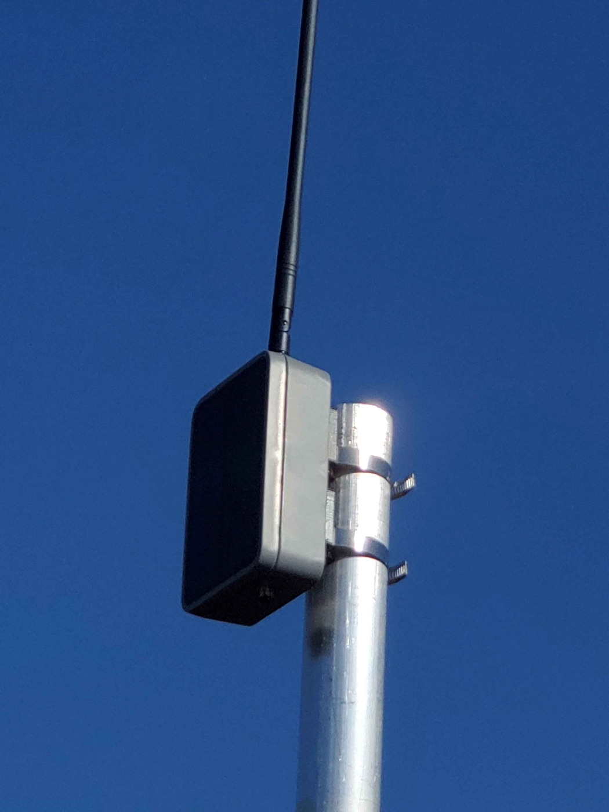
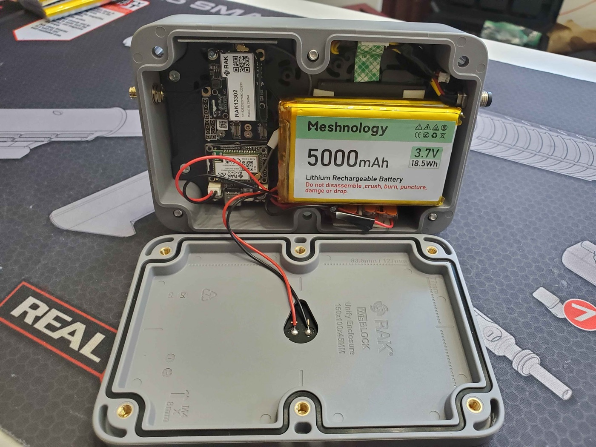
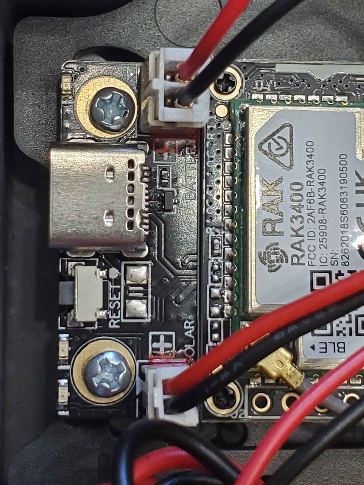
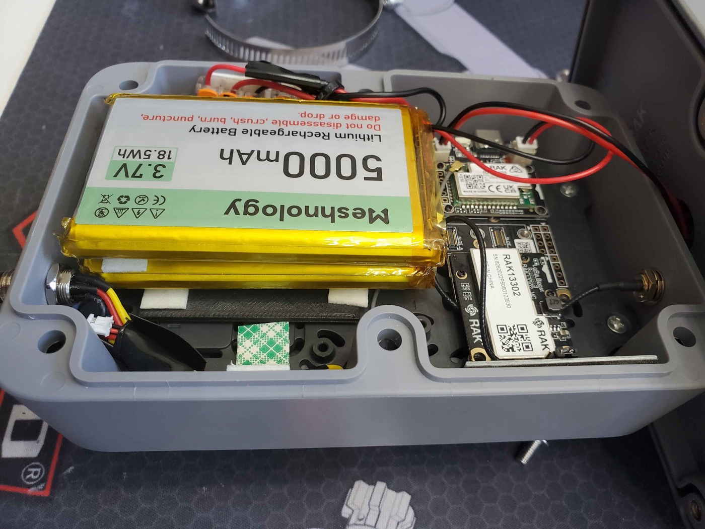
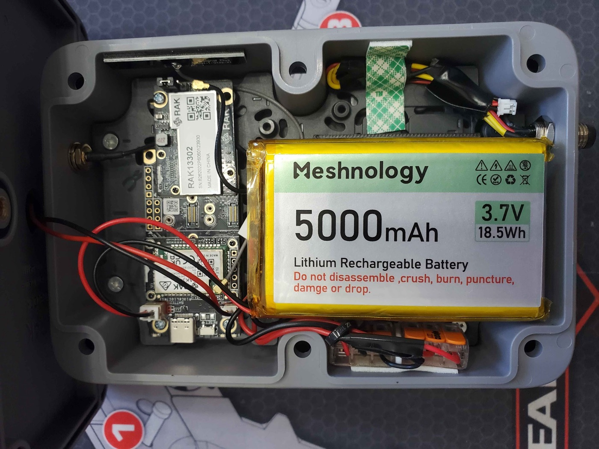
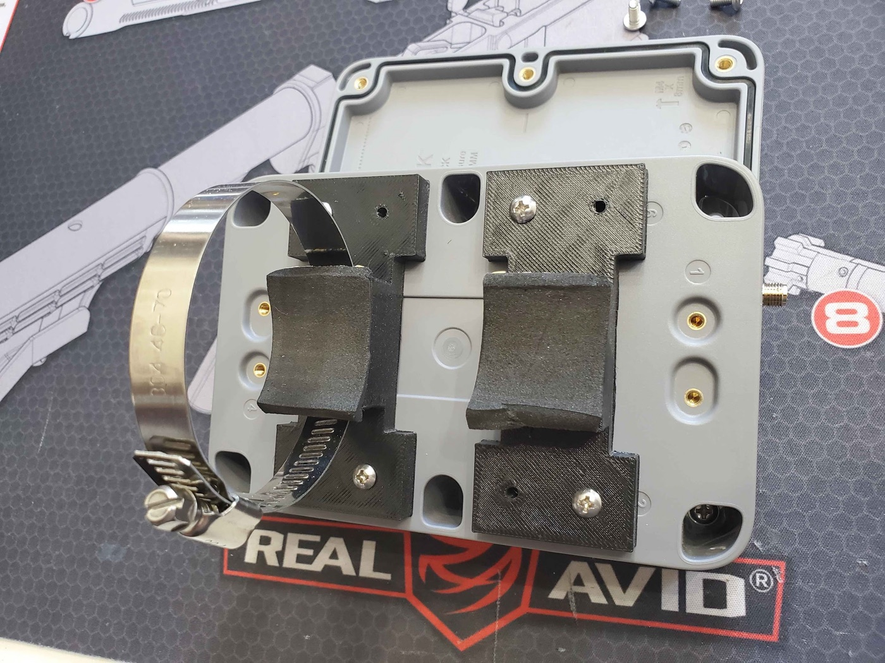

---
hide:
  - navigation
title: WisMesh Repeater Mini 1W Build Guide
description: A complete, beginner-friendly build guide for the WisMesh Repeater Mini 1W — a self-sustaining 1 watt solar Meshtastic rooftop node. A community build by prayingmedic.
---

# :material-tools: WisMesh Repeater Mini 1W — Solar Build Guide

A complete, step-by-step guide to building a **1 watt (30 dBm) solar-powered rooftop node** that runs itself off the sun, 24/7. This is our **#1 recommended rooftop node** — and you don't need to solder a single thing to build it.

<figure style="margin: 0 auto; max-width: 420px;">
  
  <figcaption style="text-align: center; font-size: 0.85em; opacity: 0.75;">The finished node on a 10 ft mast. Build &amp; photo by prayingmedic — click to enlarge.</figcaption>
</figure>

!!! success "Community build by prayingmedic :heart:"
    This entire build — the design, every photo on this page, and the real-world field testing — is the work of community member **prayingmedic**. He figured out that the RAK 1 Watt Booster board drops right into the WisMesh Repeater Mini's solar enclosure, dialed in the battery and mounting details, and ran it on a mast for days to prove it sustains itself on solar.

    **Huge thanks, prayingmedic.** This is his build; we're just writing it down. Got questions about the build? Ask in the [build thread on our Discord](https://discord.com/channels/1270431345734062133/1512210845558378556) — prayingmedic is in there answering questions. (New to the server? [Join here](https://discord.gg/HrKtyuFEQk) first.)

---

## :material-help-circle: What You're Building (and Why)

You're putting a **RAK 1 Watt LoRa Booster board** inside the **solar enclosure from a WisMesh Repeater Mini**. The result is a weatherproof, solar-powered node that:

- **Transmits at 1 watt (30 dBm)** — about **6x the transmit power** of a typical 22 dBm node. It also *hears* better, thanks to a built-in RF filter on the radio module.
- **Runs itself off the sun.** The nRF52840 chip sips power, so the enclosure's small solar panel keeps the battery topped up and the node alive around the clock.
- **Is legal at full power** when paired with the recommended 5.8 dBi antenna (more on the math below).

**Why this build?** Our previous #1 rooftop pick, the Station G2, is **sold out and very hard to get**. This build delivers serious range and a self-sustaining solar node for around **$100-150 in parts** — and it's genuinely easy to put together.

!!! info "Arizona note"
    Solar nodes shine here — pun intended. Just remember Arizona's extremes: 115F+ heat, intense UV, and monsoon storms. This enclosure is weatherproof, and prayingmedic's testing (below) shows it holds charge well even mounted in the worst-case orientation.

---

## :material-format-list-checks: Parts List

Everything you need. The kit is the only "expensive" part — the rest is cheap.

| Part | What it is | Price | Buy |
|---|---|---|---|
| **RAK 1W LoRa Booster Kit (RAK3401)** | The brains + 1W radio. Includes the base board, nRF52840 core, the 1W LoRa module, and a USB-C cable. | ~$39 | [RAK Store](https://store.rakwireless.com/products/meshtastic-1w-lora-booster-kit-rak3401) |
| **WisMesh Repeater Mini** | The donor — you're using its **solar enclosure, solar panel, antenna cable, and screws**. | ~$50-70 | [Rokland](https://store.rokland.com/products/wismesh-repeater-mini-reliable-coverage-expansion-for-smart-networks) |
| **Alfa 5.8 dBi whip antenna (RP-SMA)** | The antenna. Screws right onto the enclosure's antenna cable — no adapter needed. | ~$12 | [Rokland](https://store.rokland.com/collections/802-11ah-wi-fi-halow/products/alfa-network-ars-9096rp-5-dbi-indoor-antenna-for-helium-hotspots) |
| **Meshnology 5Ah battery** | 3.7V Li-ion pack with a JST connector. The 1W TX surge needs a real battery — see the warning below. | ~$20 | [Amazon](https://www.amazon.com/Meshnology-Rechargeable-955565-Protection-Development/dp/B0FFM9MDPR/?th=1) |

### :material-printer-3d: 3D-Printed Parts (optional, but recommended for mast mounting)

prayingmedic designed two printable parts. You don't strictly need a 3D printer to build the node — only to mast-mount it the way he did.

| Part | What it's for | STL |
|---|---|---|
| **Mast-mount brackets** | Clip onto the back of the enclosure; accept hose clamps for vertical mast mounting. | [Download STL](https://u.pcloud.link/publink/show?code=XZPqoI5ZKPgwakGbUJStyvrzPUQXVjBXdPM7) |
| **Battery spacer (1/8" thick, 2" square)** | Goes under the battery so it lies flat — a boss on the mounting plate makes the battery tilt without it. | [Download STL](https://u.pcloud.link/publink/show?code=XZoqoI5ZKKELnYkIrap8TvU7T73gMkXI3ENV) |

### :material-toolbox: Small Hardware &amp; Tools

| Item | Why | Needed? |
|---|---|---|
| **M3 machine screws** | All the mounting hardware. | Required |
| **Hose clamps** (2) | Strap the printed brackets to your mast. | For mast mount |
| **Lever nuts** (e.g. Wago) | Solderless way to wire two batteries in parallel. | Only for the dual-battery upgrade |
| **3M double-sided foam tape** | Secures the battery (or stacked batteries) inside. | Recommended |
| **Small Phillips screwdriver** | Opens/closes the enclosure clamshell. | Required |
| **Computer (Windows/Mac/Linux) + Chrome or Edge** | To flash the firmware. | Required |

---

!!! tip "Difficulty &amp; time"
    **Difficulty:** Beginner. **No soldering required** (unless you do the optional dual-battery upgrade, and even that uses solderless lever nuts). 
    **Time:** About **30-60 minutes** for the build, plus a few minutes to flash and configure. 
    **Tools:** Just a small Phillips screwdriver and a computer to flash firmware.

---

## :material-power-plug: Two Power Modes — Leave the Jumper on INTERNAL

Before you build, understand one critical thing about this board. The 1W radio module has a small **3-pin jumper** that selects how the board is powered:

- **INTERNAL** (this build) — A **3.7V Li-ion battery is mandatory.** It supplies the big current surge the 1W transmitter needs. USB-C and the solar panel only **charge** the battery — neither one can power the board on its own in this mode. The Repeater Mini's solar panel plugs into the solar header and keeps the battery full.
- **EXTERNAL** — A 5V/1.5A supply into the jack on the back of the radio module powers everything (for AC-powered installs). **We are not using this mode.**

!!! danger "Leave the jumper on INTERNAL — and the battery is NOT optional"
    For this solar build, **leave the jumper on INTERNAL** (its default). In this mode the board **cannot run without a battery installed** — USB-C or the solar panel alone will not power it. The battery is what delivers the 1W transmit surge.

---

## :material-wrench: Build It — Step by Step

### Step 1 — Open the enclosure and remove the stock board

1. Using your Phillips screwdriver, remove the screws holding the clamshell enclosure together and open it up. **Keep the screws** — you'll reuse them to close it.
2. Inside you'll find the stock **RAK4631** board on a mounting plate. Gently unplug its battery/solar connectors and lift the stock board off the mounting plate. Set it aside (you won't use it for this build).

### Step 2 — Mount the 1W board

The 1W board is designed to drop right in.

1. Place the RAK 1W board onto the **same standard mounting-plate holes** the stock board used. **No modification is needed** — the holes line up.
2. Secure it with **M3 machine screws**.

<figure style="margin: 0 auto; max-width: 420px;">
  
  <figcaption style="text-align: center; font-size: 0.85em; opacity: 0.75;">1W board mounted on the stock plate, next to the 5Ah battery. Photo: prayingmedic.</figcaption>
</figure>

### Step 3 — Prep the battery (check polarity FIRST)

The standard RAK4631 build typically uses a 3Ah flatpak. For the 1W upgrade, prayingmedic recommends a **5Ah battery** to comfortably feed the bigger transmitter.

!!! danger "CAUTION: Double-check battery lead polarity before you plug it in"
    The battery JST connector polarity is **not standardized** across vendors. RAK boards put the **positive lead on the INBOARD side** of both the battery and solar sockets.

    **Before connecting anything**, look at your battery's leads:

    - If the **red (positive)** lead is on the **inboard** side — great, you're good.
    - If the **red (positive)** lead is on the **outboard** side — **stop.** Cut the battery leads and **swap red and black** before powering on. Plugging in reversed polarity can damage the board.

    In prayingmedic's close-up photo below, the **BLACK lead is on the inboard side** — that's because he swapped the leads on that pack, so on his battery **black is the positive lead.** Always verify *your* battery, not the photo.

<figure style="margin: 0 auto; max-width: 420px;">
  
  <figcaption style="text-align: center; font-size: 0.85em; opacity: 0.75;">The BATTERY and SOLAR sockets, RESET, USB-C, and the "+" silkscreen. Note: in this photo black is positive — prayingmedic swapped the leads on this pack. Photo: prayingmedic.</figcaption>
</figure>

!!! tip "Optional: dual-battery upgrade for extra runtime"
    Want even more buffer for cloudy stretches? prayingmedic's prototype runs **two 5Ah batteries wired in parallel** (red-to-red, black-to-black) using **solderless lever nuts** (e.g. Wago). The two packs are **stacked and secured with 3M double-sided foam tape.**

    Because a boss on the mounting plate makes the batteries sit tilted, he printed a **thin (1/8" thick) 2" square spacer** to slip underneath so they lie flat. (See the [battery spacer STL](https://u.pcloud.link/publink/show?code=XZoqoI5ZKKELnYkIrap8TvU7T73gMkXI3ENV) above.)

    <figure style="margin: 0 auto; max-width: 420px;">
      
      <figcaption style="text-align: center; font-size: 0.85em; opacity: 0.75;">Two 5Ah packs stacked in parallel. Photo: prayingmedic.</figcaption>
    </figure>

### Step 4 — Connect the battery, then the solar panel

Once polarity is verified and the battery (or stacked batteries) is secured with foam tape:

1. Plug the **battery JST** into the **BATTERY** socket (the battery JST is a PH 2.0 connector).
2. Plug the enclosure's **solar panel JST** into the **SOLAR** socket.

The solar header only charges the battery — that's exactly what you want. It keeps the pack topped up so the node never runs out of juice.

<figure style="margin: 0 auto; max-width: 420px;">
  
  <figcaption style="text-align: center; font-size: 0.85em; opacity: 0.75;">Assembled internals — board, battery, and wiring. Photo: prayingmedic.</figcaption>
</figure>

### Step 5 — Attach the antenna (BEFORE you ever power on)

The enclosure's supplied antenna cable is a **reverse-polarity SMA (RP-SMA)** connector. Rather than mess with adapters, pair it with the **Alfa 5.8 dBi whip antenna** — it screws right on and works great.

1. Route the antenna cable to the enclosure's bulkhead.
2. Screw the **Alfa 5.8 dBi whip** onto the RP-SMA connector — snug but don't overtighten.

!!! danger "NEVER power the board without an antenna attached"
    Powering on a 1W transmitter with no antenna can **burn out the power amplifier** instantly. **Antenna first, always** — before you connect the battery's full power path, before you flash, before anything. Make this a habit.

### Step 6 — Flash the Meshtastic firmware

The nRF52840 chip flashes by drag-and-drop — no special software, just a web browser and the included USB-C cable. **Confirm your antenna is attached (Step 5) before this.**

1. Open **[flasher.meshtastic.org](https://flasher.meshtastic.org/)** in **Chrome** or **Edge** on your computer.
2. Plug the node into your computer with the **included USB-C cable**.
3. **Double-tap the RESET button** on the board. The node enters **DFU mode** and mounts on your computer as a USB drive (like a flash drive).
4. In the flasher, select the device named **`RAK3401 1W`** and pick the latest stable firmware. Download the firmware file — it will be named like **`firmware-rak3401-1watt-X.X.X.xxxxxxx.uf2`**.
5. **Drag and drop that `.uf2` file onto the USB drive** the node mounted as. It will copy, the node will reboot automatically, and you're flashed.

!!! info "Why drag-and-drop instead of one-click flashing?"
    This board uses the nRF52840's built-in **UF2 bootloader**. The official device target is **`rak3401-1watt`** (shown as **"RAK3401 1W"** in the flasher), and it installs by **double-tap-reset DFU + dropping the UF2** rather than a serial flash. If your browser can't drive the flasher, you can also grab the same `firmware-rak3401-1watt-*.uf2` from the [official Meshtastic firmware releases](https://github.com/meshtastic/firmware/releases) and drag it on manually.

### Step 7 — Close it up

1. Tidy the wiring so nothing is pinched.
2. Bring the clamshell halves together and drive the **supplied screws through the back half** of the clamshell to seal it.

### Step 8 — Mast-mount it

1. Attach the **3D-printed brackets** to the back of the enclosure with **M3 machine screws**.
2. Run **hose clamps** through the brackets and around your mast, then tighten.
3. Mount it as **high** as you can with clear line-of-sight. Height matters more than anything else (see the gotchas below).

<figure style="margin: 0 auto; max-width: 420px;">
  
  <figcaption style="text-align: center; font-size: 0.85em; opacity: 0.75;">3D-printed brackets with hose clamps for mast mounting. Photo: prayingmedic.</figcaption>
</figure>

!!! tip "Configure before final mounting"
    Bluetooth range on this 1W kit can be **very short (~3-6 feet)**. Keep your phone right next to the node when configuring — or just do all your configuration on the bench **before** you put it up on the mast.

---

## :material-cog: Configuration

Flashing is not configuring — **do not skip this part.** Set the node up the same way as every other node on the Arizona mesh:

1. **Follow the [How to Connect](/docs/how-to-connect.html) guide** to pair the node and get it on the mesh.
2. **Apply everything on the [Recommended Settings](/docs/recommended-settings.html) page** — region, role, channels, and broadcast intervals all live there. Those settings keep the whole Arizona mesh healthy; this guide doesn't repeat them.

### Settings specific to this build

Only a few settings differ from a standard node because of the 1W radio and solar power:

| Setting | Value | Why |
|---|---|---|
| **TX Power** | `30` dBm | Full 1 watt. (See the EIRP and weather notes below.) |
| **Power Saving** | **ON** | Energy efficiency is a priority on a solar node. |
| **Bluetooth** | Off if not needed | Saves power. If you turn BT off, plan to manage the node with an **admin node** remotely. |

!!! warning "Don't pick Router/Router Late just because it's powerful"
    A 1W node is tempting to set as a Router — **don't, unless your site genuinely calls for it.** Router roles are for high-elevation, permanent, line-of-sight repeater sites. For a home rooftop, stick with the role guidance on [Recommended Settings](/docs/recommended-settings.html). If you think your location qualifies, ask the community on Discord first.

!!! danger "EIRP compliance — stay legal"
    Your **effective radiated power** is TX power **plus** antenna gain:

    > 30 dBm (1W) **+** 5.8 dBi antenna **≈ 35.8 dBm EIRP**

    That's **just under the 36 dBm US 915 MHz ISM limit** — so this build is compliant **as specced**, at full 30 dBm with the 5.8 dBi Alfa whip. **Do not pair full 30 dBm power with a higher-gain antenna** — you'll exceed the legal limit. If you use a bigger antenna, turn TX power down to compensate.

!!! tip "Cloudy weather? Back off the TX power"
    prayingmedic tested in full sun. He hasn't yet run it through an extended cloudy stretch, so for **inclement weather** a safe bet is to drop TX power to about **26-28 dBm** to be gentler on the battery. With good sun, full 30 dBm holds charge fine (see his results below).

---

## :material-test-tube: prayingmedic's Real-World Test Results

prayingmedic mounted the node **vertically on a 10 ft mast** in **CLIENT** mode and ran it for **5 sunny days**. He deliberately tested the *worst-case* orientation (vertical, panel not facing straight up).

- **TX power schedule:** 30 dBm for 48h → 28 dBm for 48h → 30 dBm for 24h. **The TX setting made no noticeable difference in power consumption.**
- **Channel utilization:** **6-13% per day.**
- **Battery voltage:** started at **3.82V** and stayed within a tight **3.80-3.84V** band the *entire* 5 days.

**Takeaway:** With adequate sun, the state of charge holds in a very narrow band near the deployment voltage — at least through the first few weeks.

!!! note "Things prayingmedic points out"
    - **Horizontal mounting** (solar panel facing up) would likely harvest *more* solar than the vertical orientation he tested — so his numbers are conservative.
    - It hasn't yet been tested through **extended cloudy weather** — that's why ~26 dBm is the safe inclement-weather setting.
    - **Energy saving is the priority:** turn **power saving ON**, and turn **Bluetooth OFF if you don't need it** (manage settings via an **admin node** if BT is off). Keep broadcast intervals reasonable.

---

## :material-youtube: Further Watching

Want to go deeper on the RAK 1W kit and its power behavior? **Atlavox** has two excellent videos:

- :material-play-circle: [RAK 1W Booster Deep Dive — A Use-Case Nobody's Talking About](https://www.youtube.com/watch?v=SQ8TnKPmTn4)
- :material-play-circle: [RAK 1watt Booster Power Requirements](https://www.youtube.com/watch?v=S28xwvTSWZ8)

---

## :material-bug: Troubleshooting &amp; Gotchas

!!! warning "Node won't power on"
    In **INTERNAL** mode, the board **needs a battery** — USB-C or solar alone won't run it. Confirm the battery is plugged in, charged, and correct polarity. Confirm the jumper is on **INTERNAL**.

!!! danger "Never test without an antenna"
    Worth repeating: powering the 1W transmitter with no antenna can fry the amplifier. Antenna on first, every time.

!!! warning "Battery polarity"
    If the node behaves oddly after a battery swap, re-verify polarity. RAK uses **positive inboard** — if your pack has red on the outboard side, you must swap the leads (prayingmedic did exactly that, which is why black is positive in his close-up).

!!! tip "Can't connect over Bluetooth"
    BLE range on this kit is **short (~3-6 ft)**. Stand right next to the node, or configure it on the bench before mounting.

!!! info "Position, antenna, cable, power — in that order"
    Range comes from **height and line-of-sight first**, then antenna, then cable quality, then transmit power. The 1W boost is a real help, but it does **not** replace getting the node up high. Mount it as high as you safely can.

!!! question "Stuck on something?"
    Ask in the [build thread on our Discord](https://discord.com/channels/1270431345734062133/1512210845558378556) — prayingmedic himself is in the thread and happy to help. ([Join the server](https://discord.gg/HrKtyuFEQk) first if you're not in it yet.)

---

#### Next Steps

- [Recommended Hardware](/docs/recommended-hardware.html) — see how this stacks up against other rooftop nodes
- [Recommended Settings](/docs/recommended-settings.html) — full role and interval guidance for the Arizona mesh
- [How to Connect](/docs/how-to-connect.html) — get your node on the Arizona mesh
- [What Now?](/docs/what-now.html) — confirm the mesh can actually hear you

---

*Build, photos, and field testing by **prayingmedic**. Prices are estimates as of early 2026 and may vary — check retailer links for current pricing.*
